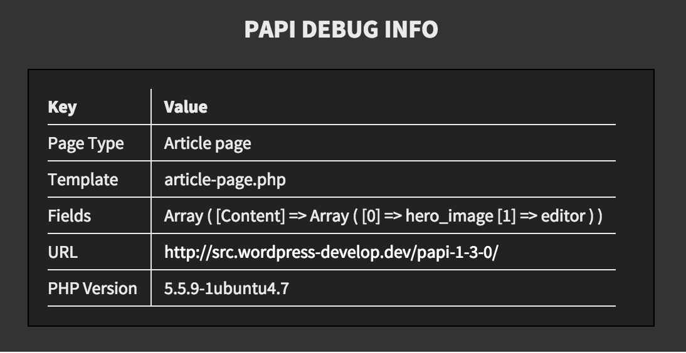

# Papi dev theme

This is the theme that is used when developing and testing Papi.
It has a debug information before the content and it is just a normal setup of page types.

## License

MIT © [Fredrik Forsmo](https://github.com/frozzare)
